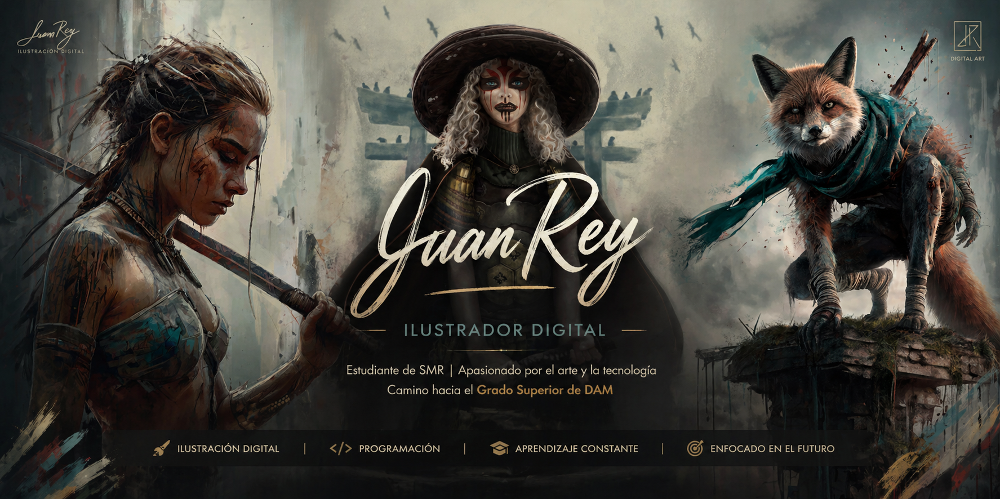

# ¡Hola! Soy Juan Rey 👋

## 🎨 Ilustrador Digital | 💻 Estudiante de SMR | 🚀 Futuro Programador DAM

 

### 👤 Sobre mí
- 📚 Actualmente cursando **1º de SMR** (Sistemas Microinformáticos y Redes).
- 🎨 Artista digital con enfoque en concept art y diseño de personajes.
- 🎯 Mi objetivo es terminar SMR para especializarme en **Desarrollo de Aplicaciones Multiplataforma (DAM)**.
- 💡 Me motiva unir el mundo visual con la resolución de problemas mediante código.

### 🛠️ Tecnologías que estoy aprendiendo
- **Sistemas:** Gestión de Redes, Windows/Linux Server, Montaje de Equipos.
- **Software:** Administración de Bases de Datos (SQL), HTML y CSS básico.
- **Diseño:** Procreate, Photoshop, Ilustración Digital.

---
*📩 Puedes contactar conmigo a través de mi perfil de GitHub para cualquier colaboración.*
